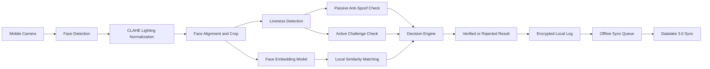

# NHAI Offline Facial Recognition & Liveness Detection System

Offline-first facial recognition and liveness detection system designed for NHAI field operations, zero-network zones, and Datalake 3.0 integration.


## Problem Statement

NHAI field staff may need secure identity verification in locations where network connectivity is weak, delayed, or completely unavailable. This project proposes a lightweight, mobile-ready facial recognition and liveness detection system that can authenticate users offline and sync verification logs when connectivity returns.

The goal is not just face matching. The goal is reliable, explainable, and spoof-resistant identity verification under Indian field conditions such as harsh sunlight, shadows, low-end devices, and zero-network environments.

## Core Advantages

| Capability | Why It Matters for NHAI |
|---|---|
| Offline-first verification | Works in remote toll, road, and construction zones without live internet |
| CLAHE lighting normalization | Improves face quality in harsh sunlight, shadows, and uneven lighting |
| Two-layer liveness detection | Combines passive anti-spoofing with active user challenges |
| Lightweight face embeddings | Enables fast local matching on mid-range mobile devices |
| Encrypted local storage | Keeps biometric templates and logs secure on-device |
| Pending sync queue | Stores events locally and syncs with Datalake 3.0 when network returns |
| Explainability support | Grad-CAM style visual reasoning helps examiners trust model decisions |

## System Architecture



## Offline Verification Flow

1. User opens the mobile verification screen.
2. Camera captures face frames locally.
3. System applies lighting normalization and face alignment.
4. Face embedding is generated on-device.
5. Liveness check verifies that the input is a real person, not a photo or screen replay.
6. Local encrypted template database performs similarity matching.
7. Result is shown instantly.
8. Verification event is stored in the pending sync queue.
9. When network returns, logs are synced to Datalake 3.0.

## Liveness Detection Strategy

This project uses a two-layer anti-spoofing plan:

| Layer | Method | Purpose |
|---|---|---|
| Passive liveness | Lightweight FASNet-style model | Detects printed photo, screen replay, and flat texture attacks |
| Active liveness | Blink, head turn, or randomized prompt | Confirms real-time human presence |

This combination is stronger than using only blink detection because blink-only systems can be fooled by replay videos. The passive layer catches visual spoof artifacts, while the active layer prevents static-image attacks.

## Tackling Indian Field Conditions

NHAI field environments are not clean office environments. The system is designed around real deployment constraints:

- Harsh sunlight near roads and toll plazas
- Deep shadows from helmets, vehicles, and roadside structures
- Dusty or blurred camera input
- Mid-range mobile hardware
- Delayed or unavailable network connectivity
- Need for fast verification without server round trips

CLAHE preprocessing improves local contrast before recognition, making the face pipeline more robust under uneven lighting.

## Security and Privacy

- Raw face images should not be stored by default.
- Face embeddings are stored locally in encrypted form.
- Verification logs are queued locally when offline.
- Sync payloads can be signed and timestamped.
- Failed spoof attempts are logged for audit review.

## Performance Targets

| Metric | Target |
|---|---|
| Verification mode | Fully offline |
| Recognition latency | Under 1 second on mid-range devices |
| Model size | Lightweight mobile-ready model |
| Sync behavior | Automatic retry with pending queue |
| Liveness | Passive plus active anti-spoofing |
| Storage | Encrypted local database |

## Repository Structure

```txt
NHAI-Offline-Facial-Recognition-System/
|-- models/
|   `-- .gitkeep
|-- python-scripts/
|   `-- .gitkeep
|-- src/
|   |-- components/
|   |-- screens/
|   |-- services/
|   `-- utils/
|-- docs/
|   |-- MASTER_PLAN.md
|   |-- ARCHITECTURE.md
|   `-- SETUP.md
|-- assets/
|   |-- architecture-diagram.png
|   `-- demo.gif
|-- .gitignore
`-- README.md
```

## Planned Screens

- Enrollment screen
- Offline verification screen
- Liveness challenge screen
- Verification result screen
- Pending sync queue screen
- Admin audit summary screen

## Roadmap

- [x] Initialize repository structure
- [x] Add project README
- [x] Add master implementation plan
- [x] Add architecture documentation
- [ ] Build mobile UI prototype
- [ ] Implement face detection pipeline
- [ ] Add CLAHE preprocessing
- [ ] Integrate face embedding model
- [ ] Add passive liveness detection
- [ ] Add active liveness challenge
- [ ] Add encrypted local storage
- [ ] Add offline sync queue
- [ ] Add demo video and screenshots

## Hackathon Impact

This solution is designed to help NHAI continue secure digital operations in places where internet connectivity cannot be guaranteed. It reduces dependency on cloud authentication, improves field reliability, and adds anti-spoofing safeguards needed for trust-sensitive identity verification.

