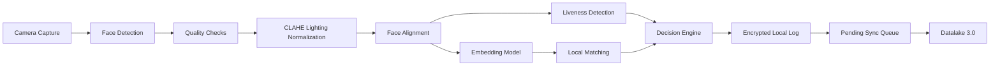

# Architecture

## Overview

The system is designed as an offline-first mobile identity verification module for NHAI field use. The core idea is to perform face capture, preprocessing, recognition, liveness detection, and verification locally on-device, then sync audit logs to Datalake 3.0 when connectivity returns.

## Pipeline

## Main Components

| Component | Responsibility |
|---|---|
| Camera capture | Capture face frames and guide user positioning |
| Quality checks | Detect blur, poor lighting, no face, or multiple faces |
| CLAHE preprocessing | Improve local contrast under sunlight and shadows |
| Face embedding model | Generate compact biometric representation |
| Liveness detection | Reject photo, screen replay, and static spoof attacks |
| Decision engine | Combine face match, liveness score, and quality result |
| Local storage | Store encrypted embeddings and verification logs |
| Sync queue | Retry Datalake 3.0 sync when network returns |

## Decision Logic

The verification decision should use multiple signals instead of only face similarity:

- Face match score
- Passive liveness score
- Active challenge result
- Image quality result
- Device/network state

Expected states:

- `VERIFIED`
- `REJECTED`
- `SPOOF_SUSPECTED`
- `LOW_CONFIDENCE`
- `RETRY_REQUIRED`
- `PENDING_SYNC`

## Offline-First Data Flow

1. Enrolled face embeddings are stored locally in encrypted storage.
2. Verification runs fully on-device.
3. Result is shown immediately to the field user.
4. Audit event is written to local storage with timestamp and sync status.
5. Sync queue retries upload when internet connectivity is available.

## Security Notes

- Store embeddings instead of raw face images by default.
- Encrypt local biometric templates and verification logs.
- Keep spoof attempts in audit logs.
- Sign sync payloads before sending to backend systems.
- Avoid sending biometric data over the network unless required by integration policy.

